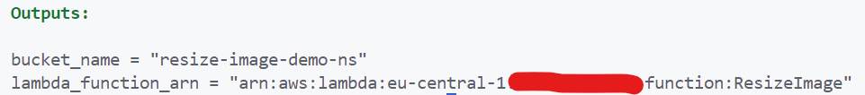
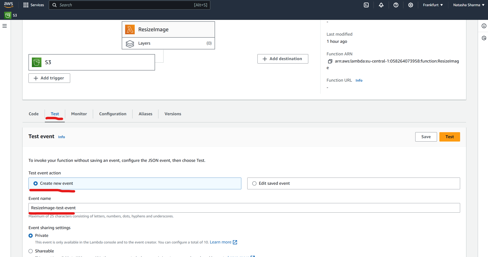
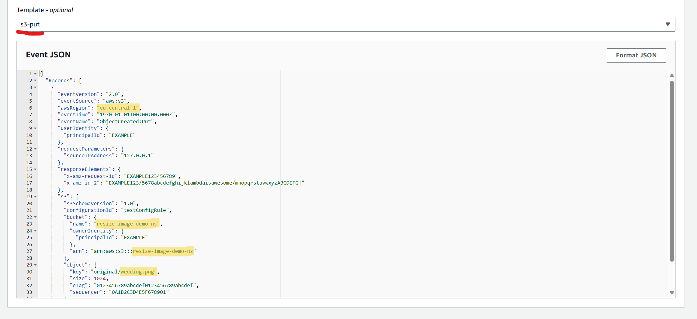
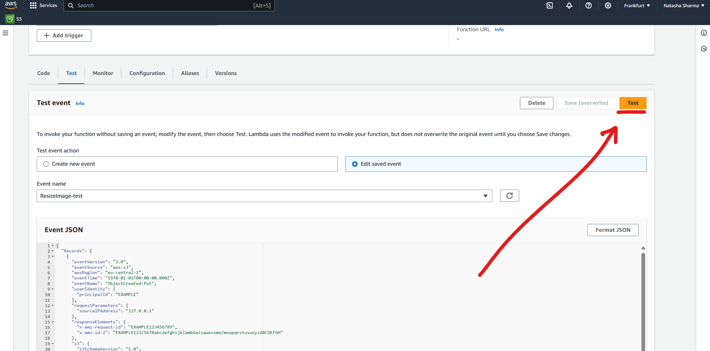
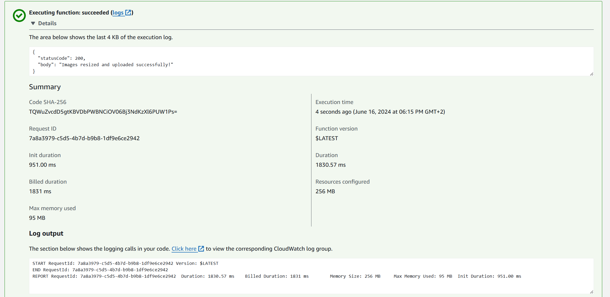

# Using an Amazon S3 Trigger to Resize Images

In [Introduction to Serverless Services on AWS](https://nssharma.hashnode.dev/introduction-to-serverless-services-on-aws) I have introduced AWS Lambda as one of serverless services on AWS and in [AWS Lambda Step-by-Step Tutorial (Console): Using an Amazon S3 Trigger to Resize Images](https://hashnode.com/post/clxx8ih7200050al362ij9lm2) I showed how to create Amazon S3 trigger to resize images using AWS Lambda in the console.

Now, let's go through the same example - but this time, using *Terraform*. 🤯

This tutorial is beginner friendly - you do not need any previous experience with Terraform.

## How will it work? 💡

When you add an image file to your `original` folder in bucket, Amazon S3 invokes your Lambda function. The function then creates a resized version of the image and uploads it to a `resized` folder in the same bucket.

## What will be the steps? 🪜

1. [Set up AWS CLI](#set-up-aws-cli-)
2. [Setup Terraform](#set-up-terraform-️)
3. [Setup project](#set-up-project-)
    1. [Configure provider](#configure-provider-)
    2. [Create S3 bucket](#create-s3-bucket-and-input-example-)
    3. [Create IAM role with S3 permissions](#create-iam-role-with-s3-permissions-️)
    4. [Create Lambda function](#create-lambda-function-)
    5. [Define outputs](#define-outputs-optional-)
4. [Deploy changes](#deploy-changes)
5. [Test it out](#test-it-out-)
6. [Clean up](#clean-up-)

## Set up AWS CLI 💻

* Install the AWS CLI from [here](https://docs.aws.amazon.com/cli/latest/userguide/getting-started-install.html).
* Configure AWS CLI by running the following command and enter your AWS access key, secret key, region (in my case `eu-central-1`), and output format (for example `json`).

    ```bash
    aws configure
    ```

## Set up Terraform 🏗️

* Install the Terraform from [here](https://developer.hashicorp.com/terraform/tutorials/aws-get-started/install-cli).

## Set up project 📂

Create project folder and create two folders inside:

* **functions**
* **terraform**

We will get to all the individual components later on, but this is how it is gonna look in the end:

After creating the two folders, run `terraform init` inside the `terraform` folder. This command initializes Terraform and downloads the necessary provider plugins.

## Configure provider 🌐

Define the AWS provider and specify the region.

```terraform
// provider.tf

provider "aws" {
  region = "<YOUR-REGION>"
}
```

## Create S3 bucket and input example 🪣

First create an Amazon S3 bucket with two folders in it. The first folder is the source folder `original` in which you will upload your images to. The second folder `resized` will be used by Lambda to save the resized thumbnail when you invoke your function.

```terraform
// s3.tf

// Create the S3 bucket
resource "aws_s3_bucket" "image_bucket" {
  bucket = "<YOUR-BUCKET-NAME>"
}

// Create the folders within the bucket
resource "aws_s3_object" "original_folder" {
  bucket = aws_s3_bucket.image_bucket.bucket
  key    = "original/"
}

resource "aws_s3_object" "resized_folder" {
  bucket = aws_s3_bucket.image_bucket.bucket
  key    = "resized/"
}
```

After this step, run `terraform apply` (you will be prompted for confirmation - type `yes` to proceed). This will create your S3 bucket. Now we can upload an example input image that we will later use to check if our created Lambda is working with test event.

After the `terraform apply` command completes, Terraform will provide information about the resources it created.

To upload an image to your `original` folder, run:

```bash
aws s3 cp <YOUR-EXAMPLE.PNG> s3://<YOUR-BUCKET-NAME>/original/
```

Do not forget to replace `<YOUR-EXAMPLE.PNG>` and `<YOUR-BUCKET-NAME>` by the actual names in the code.

## Create IAM role with S3 permissions 👮🏻‍♀️

### Create a permission policy

The first step in creating your Lambda function is to create a permissions policy. This policy gives your function the permissions it needs to access other AWS resources. For this tutorial, the policy gives Lambda read and write permissions for Amazon S3 buckets and allows it to write to Amazon CloudWatch Logs.

```terraform
// iam.tf

// Define the IAM policy with necessary permissions for the Lambda function
resource "aws_iam_policy" "lambda_policy" {
  name        = "LambdaS3Policy"
  description = "IAM policy for Lambda to access S3 and logs"
  policy = jsonencode({
    Version = "2012-10-17",
    Statement = [
      {
        Effect = "Allow",
        Action = [
          "logs:PutLogEvents",
          "logs:CreateLogGroup",
          "logs:CreateLogStream"
        ],
        Resource = "arn:aws:logs:*:*:*"
      },
      {
        Effect = "Allow",
        Action = [
          "s3:GetObject"
        ],
        Resource = "arn:aws:s3:::*/*"
      },
      {
        Effect = "Allow",
        Action = [
          "s3:PutObject"
        ],
        Resource = "arn:aws:s3:::*/*"
      }
    ]
  })
}
```

### Create an execution role

An execution role is an IAM role that grants a Lambda function permission to access AWS services and resources. To give your function read and write access to an Amazon S3 bucket, you attach the permissions policy you created in the previous step.

```terraform
// iam.tf

// Define the IAM role that the Lambda function will assume
resource "aws_iam_role" "lambda_role" {
  name = "LambdaS3Role"
  assume_role_policy = jsonencode({
    Version = "2012-10-17",
    Statement = [{
      Action    = "sts:AssumeRole",
      Effect    = "Allow",
      Principal = {
        Service = "lambda.amazonaws.com"
      }
    }]
  })
}

// Attach the IAM policy to the IAM role
resource "aws_iam_role_policy_attachment" "lambda_policy_attachment" {
  role       = aws_iam_role.lambda_role.name
  policy_arn = aws_iam_policy.lambda_policy.arn
}
```

## Create Lambda Function 🚀

### Create the function deployment package

To create your function, you create a deployment package containing your function code and its dependencies.

1. Create a folder - in my case I named it `ResizeImage`
2. Create a `lambda_function.py` file in the folder and paste there this code:

    ```python
    # lambda_function.py
    import boto3
    import os
    import uuid
    from urllib.parse import unquote_plus
    from PIL import Image

    s3_client = boto3.client('s3')

    def resize_image(image_path, resized_path):
        with Image.open(image_path) as image:
            image.thumbnail(tuple(x // 2 for x in image.size))
            image.save(resized_path, 'PNG')

    def lambda_handler(event, context):
        for record in event['Records']:
            bucket = '<YOUR-BUCKET-NAME>'
            key = unquote_plus(record['s3']['object']['key'])

            if not key.startswith('original/'):
                print(f"Ignoring object {key} as it does not start with 'original/'")
                continue

            tmpkey = key.replace('/', '')
            download_path = f'/tmp/{uuid.uuid4()}{tmpkey}'
            upload_key = key.replace('original/', 'resized/')
            upload_path = f'/tmp/resized-{tmpkey}'

            s3_client.download_file(bucket, key, download_path)
            resize_image(download_path, upload_path)
            s3_client.upload_file(upload_path, bucket, upload_key)

            # Cleanup
            os.remove(download_path)
            os.remove(upload_path)

        return {
            'statusCode': 200,
            'body': 'Images resized and uploaded successfully!'
        }
    ```

    Do not forget to replace `<YOUR-BUCKET-NAME>` in the `lambda_handler` function with the actual name of your bucket.

3. In the same folder create a new directory named `package` and install the Pillow (PIL) library and the AWS SDK for Python (Boto3)

    Although the Lambda Python runtime includes a version of the Boto3 SDK, it is recommended that you add all of your function's dependencies to your deployment package, even if they are included in the runtime.

    ```bash
    mkdir package
    pip install \
    --platform manylinux2014_x86_64 \
    --target=package \
    --implementation cp \
    --python-version 3.12 \
    --only-binary=:all: --upgrade \
    pillow boto3
    ```

4. Create a `.zip` file containing your application code and the Pillow and Boto3 libraries

    ```bash
    cd package
    zip -r ../lambda_function.zip .
    cd ..
    zip lambda_function.zip lambda_function.py
    ```

### Configure the Lambda function

Use a code source from the `.zip` file that you just created. Name your Lambda function - in this case I named it `ResizeImage`. The permissions are going to be delegated to the function through IAM role - the one that we have created earlier).

Runtime is the language that your Lambda function is written in. Previously, in the package we were installing Python 3.12, so we will use this one only.

```terraform
// lambda.tf

// Define the Lambda function to resize images
resource "aws_lambda_function" "ResizeImage" {
  filename         = "../functions/ResizeImage/lambda_function.zip"  
  function_name    = "ResizeImage"
  role             = aws_iam_role.lambda_role.arn
  handler          = "lambda_function.lambda_handler"
  runtime          = "python3.12"
  memory_size      = 256
  timeout          = 60
}
```

Next, we need to configure the trigger source. We're going to select S3 for our trigger.

```terraform
// lambda.tf

// Allow S3 to invoke the Lambda function
resource "aws_lambda_permission" "allow_s3" {
  statement_id  = "AllowS3Invoke"
  action        = "lambda:InvokeFunction"
  function_name = aws_lambda_function.ResizeImage.function_name
  principal     = "s3.amazonaws.com"
  source_arn    = "arn:aws:s3:::<YOUR-BUCKET-NAME>"
}
```

Then we need to select which S3 bucket will be the event source. Do not forget to replace `<YOUR-BUCKET-NAME>` by the actual name in the code.

As the event type I want to select only a PUT.

Then we can provide a prefix (specific location inside of the bucket) - in this case the folder `original` inside the bucket.

```terraform
// lambda.tf

// Configure S3 bucket notification to trigger Lambda function
resource "aws_s3_bucket_notification" "original_notification" {
  bucket = aws_s3_bucket.image_bucket.id

  lambda_function {
    lambda_function_arn = aws_lambda_function.ResizeImage.arn
    events              = ["s3:ObjectCreated:Put"]
    filter_prefix       = "original/"
  }
}
```

Remember, we have integrated the output prefix `/resized` in the `lambda_function.py`.

## Define outputs (optional) 👀

The outputs in Terraform provide useful information about the resources created during the deployment. It is not necessary for this example, but it is a good practice to do so. After running `terraform apply` the outputs will be displayed in the terminal. You can use these outputs in the following ways:

* If you have multiple Terraform configurations that need to share information, you can use the outputs from one configuration as inputs in another.
* You can use the outputs in automated scripts. For example, if you need to perform additional operations on the S3 bucket or the Lambda function, you can use the outputs to get the necessary identifiers.

This output returns the name of the S3 bucket that was created and the Lambda function ARN:

```terraform
// outputs.tf

// Output the name of the S3 bucket
output "bucket_name" {
  value = aws_s3_bucket.image_bucket.bucket
}

// Output the Lambda function ARN
output "lambda_function_arn" {
  value = aws_lambda_function.ResizeImage.arn
}
```

## Deploy changes

Now again, after completing all steps, run `terraform apply` (you will be prompted for confirmation - type `yes` to proceed). You should see something like this in case it was successful:



## Test it out 😎

Before you test your whole setup by adding an image file to the `original` folder of your S3 bucket, you test that your Lambda function is working correctly by invoking it with a dummy event (with the image that we have uploaded to the folder previously).

1. Go to the [AWS Lambda console](https://aws.amazon.com/lambda/)
2. Go to "Test", create new event, and name it - in my case I named it `ResizeImage-test-event`

    

3. Choose S3-put template, paste this JSON in it and save it

    ```json
    {
      "Records": [
        {
          "eventVersion": "2.0",
          "eventSource": "aws:s3",
          "awsRegion": "<YOUR-REGION>",
          "eventTime": "1970-01-01T00:00:00.000Z",
          "eventName": "ObjectCreated:Put",
          "userIdentity": {
            "principalId": "EXAMPLE"
          },
          "requestParameters": {
            "sourceIPAddress": "127.0.0.1"
          },
          "responseElements": {
            "x-amz-request-id": "EXAMPLE123456789",
            "x-amz-id-2": "EXAMPLE123/5678abcdefghijklambdaisawesome/mnopqrstuvwxyzABCDEFGH"
          },
          "s3": {
            "s3SchemaVersion": "1.0",
            "configurationId": "testConfigRule",
            "bucket": {
              "name": "<YOUR-BUCKET-NAME>",
              "ownerIdentity": {
                "principalId": "EXAMPLE"
              },
              "arn": "arn:aws:s3:::<YOUR-BUCKET-NAME>"
            },
            "object": {
              "key": "original/<YOUR-EXAMPLE.PNG>",
              "size": 1024,
              "eTag": "0123456789abcdef0123456789abcdef",
              "sequencer": "0A1B2C3D4E5F678901"
            }
          }
        }
      ]
    }
    ```

    

    Do not forget to replace `<YOUR-REGION>`, `<YOUR-BUCKET-NAME>` and `<YOUR-EXAMPLE.PNG>` (also highlighted in the screenshot) by the actual names in the code.

4. Click on "Test"

    

5. We can check the execution details afterwards - as we can see, the `ResizeImage-test-event` execution succeeded

    

## Clean up 🧹

Always remember to clean up resources when you're done to avoid unexpected charges. Run `terraform destroy` or delete resources manually from the AWS Management Console.

---

Congratulations! 🥳 You've just built a cool serverless solution with AWS Lambda using Terraform that resizes images automatically when they are uploaded to an S3 bucket.
